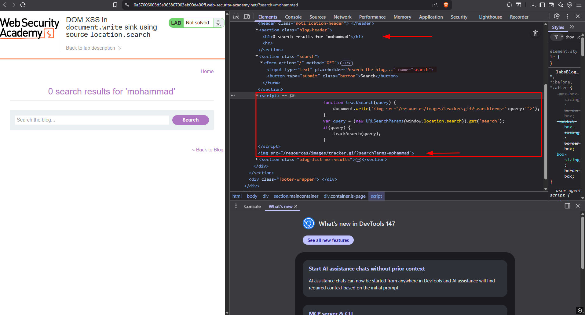
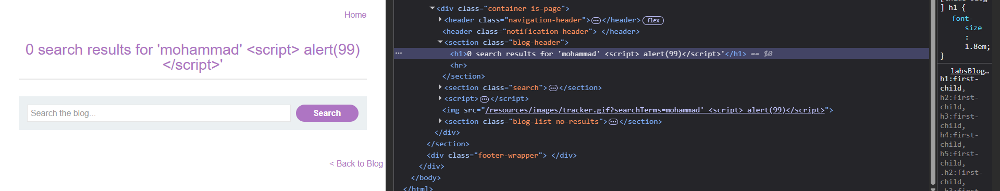
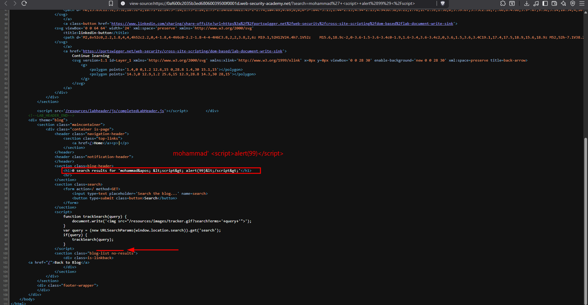
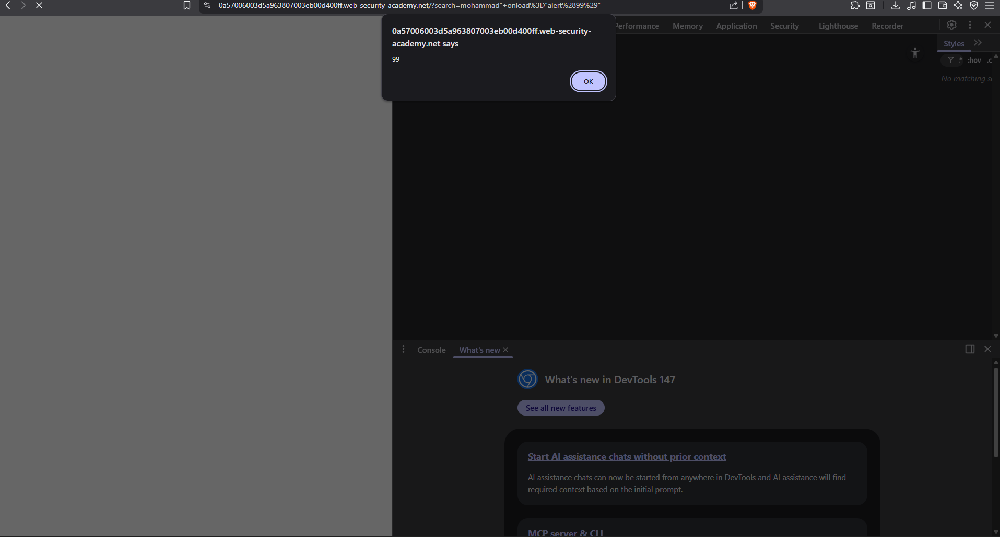
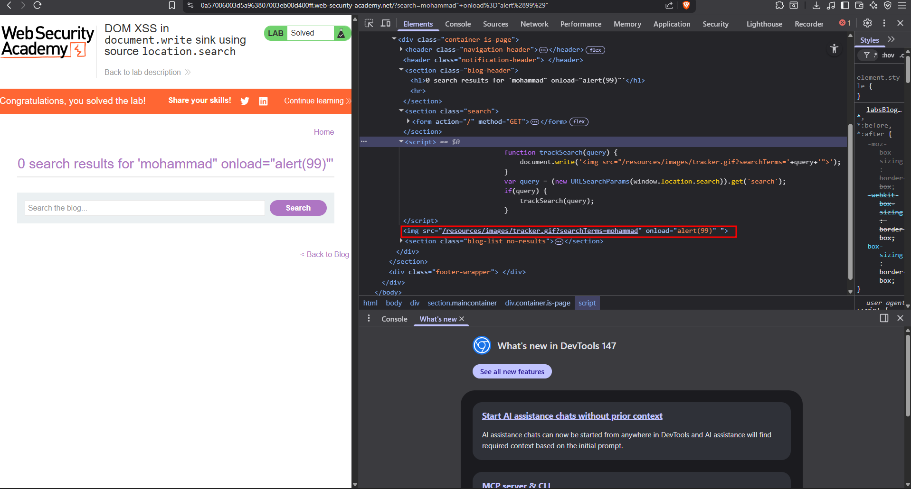

# Lab: DOM XSS in document.write sink using source location.search


---

## Step 1

### Enter any string in the search bar

Then:
- Open **Inspect (DevTools)**
- Press **Ctrl + F**
- Search for the string you entered

### Observation:
You will notice that your input appears in **two different places**.



---

## Step 2

### Attempt to inject JavaScript code

#### Payload:
```html
mohammad' <script>alert(99)</script>
```



### Result:
The `alert()` function does **not execute**.

### Reason:
After sending the request, the HTTP response **escapes single quotes** and replaces them with:

```
&apos;
```

Because of this encoding, the injected `<script>` tag is **not interpreted as executable code**, so the attack fails.



---

## Step 3


### Key Observation:
When you enter the string `"mohammad"`, it appears **twice** on the page.

### Code Analysis:

The application uses JavaScript and the `document.write()` function.

#### Explanation:

- A variable `query` stores the value of the **search parameter** from the URL.
- The condition `if (query)` checks whether the value is not empty.
- If true, it calls:
```javascript
trackSearch(query)
```

#### Inside `trackSearch()`:

- The function uses `document.write()` to dynamically write an `` element into the page.
- This image sends a request to:

```
tracker.gif?searchTerm=<query>
```

---

## Vulnerability Explanation

This is where the **DOM-based XSS vulnerability** occurs.

- The `query` value is taken directly from `location.search`
- It is **not sanitized or properly encoded**
- It is written into the page using `document.write()`

This allows an attacker to **inject malicious HTML/JavaScript code**.

---

## Exploitation

### Payload:
```html
mohammad" onload="alert(99)
```

### Explanation:

- `"` → Closes the existing `src` attribute
- `onload="alert(99)` → Injects a new event handler into the `` tag
- The `onload` event triggers when the image loads

### Result:
The `alert(99)` function executes successfully, confirming the XSS vulnerability.





---
